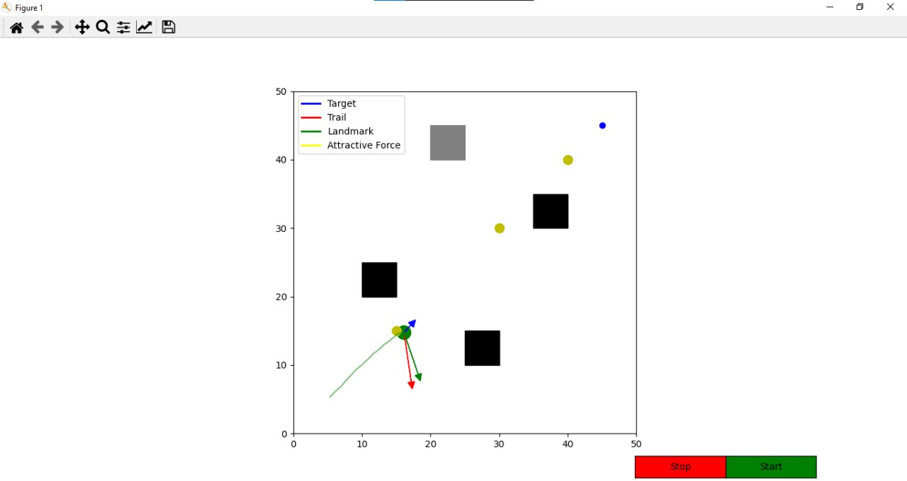

# Robot Navigation Simulation

This project simulates robot navigation using the **Cartwright and Collet model**. The robot navigates toward a target while avoiding obstacles using attractive and repulsive forces.

## Features
- Attractive force to guide the robot toward the target.
- Repulsive force to avoid obstacles.
- Dynamic obstacle avoidance.
- Landmarks ("Les Amers") for intermediate guidance.

## How to Run
1. Clone this repository:
   ```bash
   git clone https://github.com/your-username/Robot-Navigation-Simulation.git


## Install the required libraries:
 - pip install -r requirements.txt

## Run the simulation:
 - python robot_simulation.py


## Screenshot


